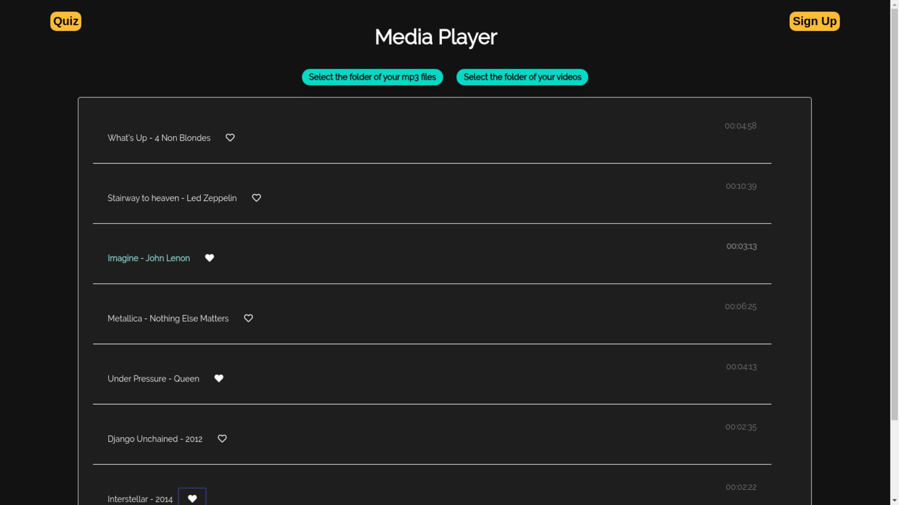
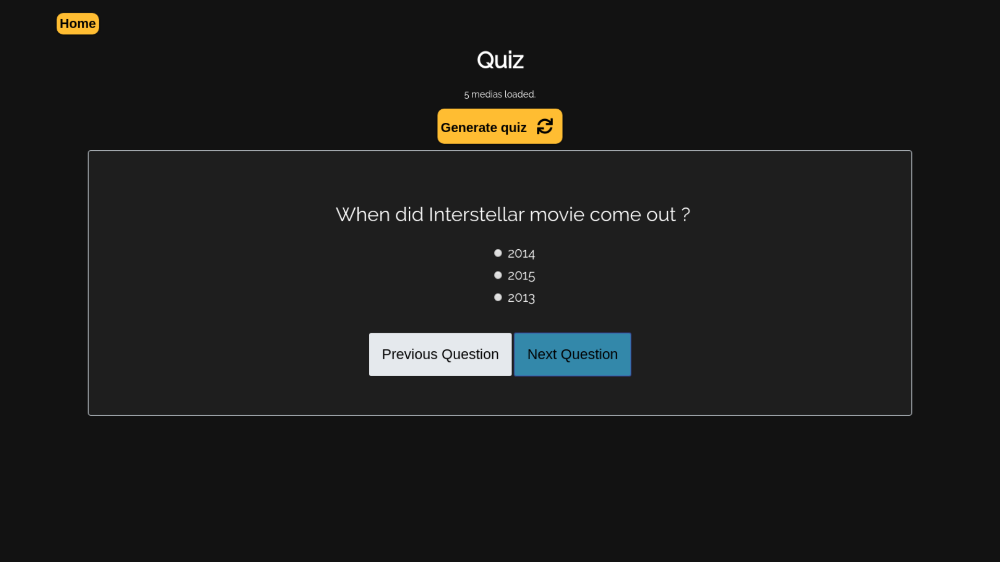
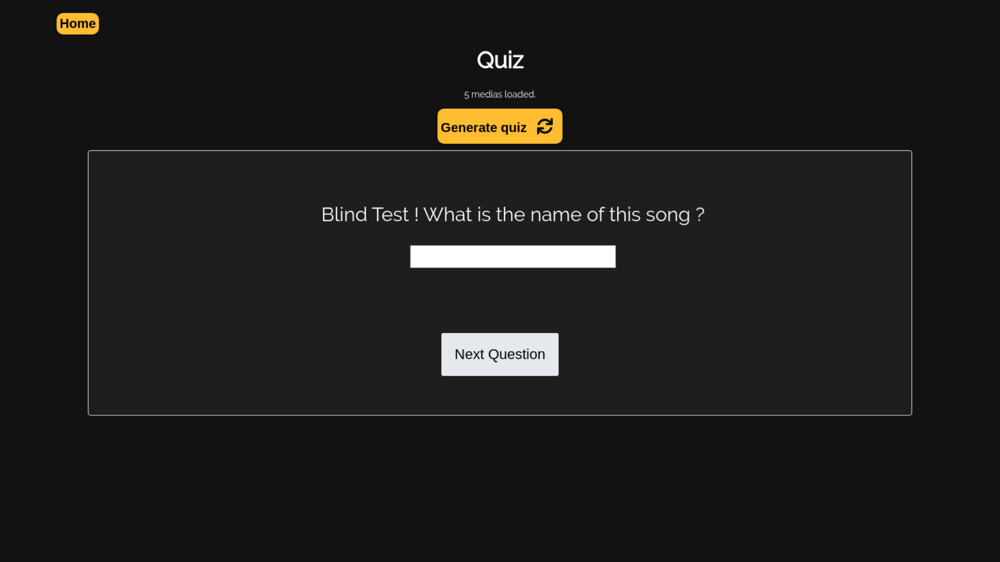
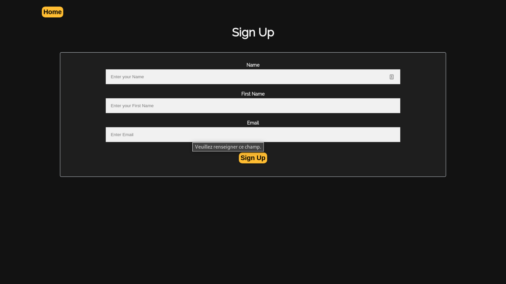
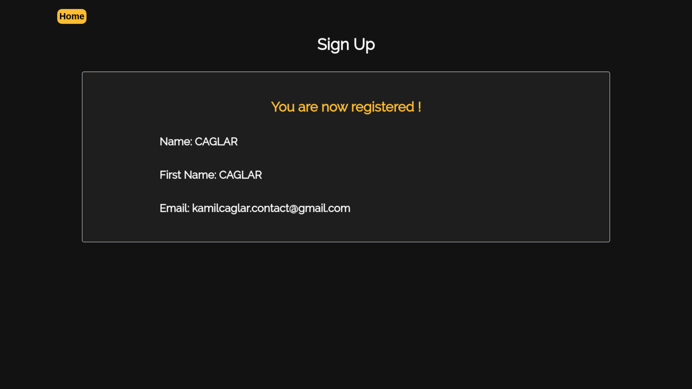
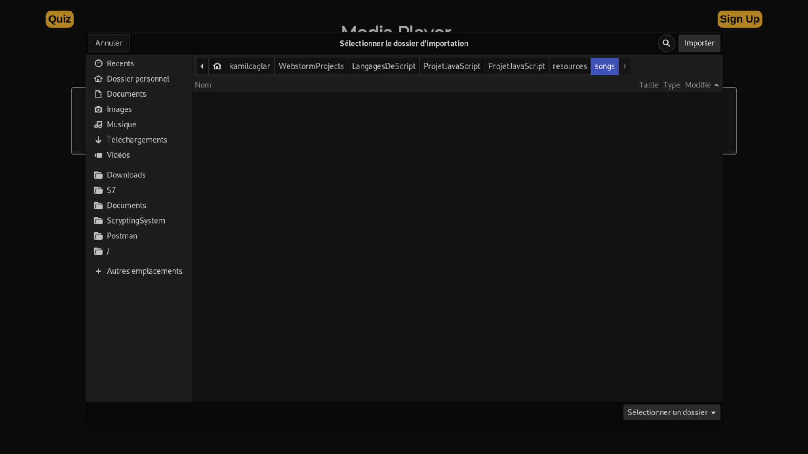

# Projet JavaScript - 2019/2020 Kamil CAGLAR
 
 Simple lecteur de musique, de vidéos. 
   
   
 Quiz et page d'inscription sans enregistrement.
  
  
  
  
 
 **Ce Readme ne détaille pas le rôle de chaque fonction (voir les commentaires dans le code) 
 mais donne une information sur l'architecture du projet.**
 
 ## Comment charger ses musiques dans le lecteur ? 
  ### Prérequis
  Le projet a été testé et fonctionne sur la dernière de Google Chrome.

  ### Charger ses musiques
  Cliquer sur le bouton "select the folder of your mp3 files" puis choisir le dossier 
  qui contient les fichiers mp3. Le titre de ces fichiers doivent respecter le format
  Titre_Artiste.mp3 pour être représentés correctement.
  
  Cliquez ensuite sur OK et valider.
  

  ### Charger ses videos
  Effectuer les mêmes opérations en cliquant sur le bouton "Select the folder of your videos".
  Le titre des videos doit respecter le format Titre_YYYY.mp4.
  
    Cliquez ensuite sur OK et valider.
  

  
 ## Architecture du projet
   **_Voir les commentaires du code pour plus de détails._**
   
   ### Media, Song et Video
   Media est la classe abstraite à partir de laquelle héritent Song et Video. 
   Les fonction play et pause ne sont pas définies dans cette classe car elle
   dépendent du type du média (audio ou video).
   
   **Méthodes de Media :** 
   * formatDuration qui permet de formatter la durée du média.
   
   **Classe Song :**
   Hérite de Media, contient en plus un champ artist et audio où audio est un
   HTMLAudioElement. 
   Méthodes de Song :
   * play joue la musique
   * pause met en pause la musique
   * stop arrête la musique 
   * toHTML retourne une chaîne de caractères qui contient le code HTML
   
   **Classe Video :**
   Hérite de Media, contient en plus un champ année et video où video est un
   HTMLVideoElement. 
   Méthodes de Video :
   * play joue la vidéo
   * pause met en pause la vidéo
   * stop arrête la vidéo 
   * toHTML retourne une chaîne de caractères qui contient le code HTML
  
   ### Playlist
   Cet object contient une liste de musique ou de vidéos. Il contient aussi 
   l'index du média qui est en cours de lecture. 
   Méthodes de Playlist :
   * play appelle la fonction play correspondant au média.
   * pause appelle la fonction pause correspondant au média.
   * stop appelle la fonction stop correspondant au média.
   * toHTML retourne une chaîne de caractères qui contient le code HTML de chaque media.
 
   ### Quiz et Question
   Un quiz contient une liste de question. 
   Le quiz contient le score, la playlist et l'index de la question. 
   Les questions sont générées grâce au format des titres des fichiers.
   La réponse exacte est récupérée depuis le nom du fichier, les autre choix sont récupérés 
   depuis une liste arbitraire présente à la fin de quiz.js.
   Les réponses possibles sont choisies aléatoirement.
   
   Lors de la génération, certaines questions sont définies comme étant des 
   blind tests. 
   
   ### App.js et index.html - Lecteur multimédia
   Ce script crée la playlist et ajoute les détections de clique sur les boutons.
   Lorsque l'utilisateur charge ses musiques et/ou ses vidéos grâce aux boutons correspondants, 
   les medias sont crées puis ajoutés dans la playlist.
   
   Des boutons permettent de passer au media suivant, de s'arrêter ou de 
   mettre en pause. 
  
  ### App2.js et quiz.html - Quiz
   Ce script charge les medias définis dans le code. Il crée le quiz et l'affiche à l'écran.
   Des boutons permettent de changer de question. 
   Lorsque l'utilisateur a répondu à la dernière question il peut soumettre le 
   quiz et avoir son résultat. Les réponses correctes sont en vert, les incorrectes en rouge. 
   
  ### SignUp.js et signUp.html - Inscription
   Ce script crée la page d'inscription. Lorsque l'utilisateur complète le formulaire correctement (bon format d'email
   et champs non vides) une page avec un résumé de l'inscription s'affiche.
 
  ## Comment réaliser l'inscription avec Ajax
  Nous pouvons réaliser ce formulaire en AJAX en utilisant un objet FormData.
  ```javascript
let XHR = new XMLHttpRequest(); //permet de construire les requêtes HTTP, les envoyer et retourner les résultats
let FD  = new FormData(); //contiendra les données

// Il faut ensuite mettre les données dans l'objet FormData
for(entry in data) {
    FD.append(entry, data[entry]);
}

// Il y aura ici ce qui se passe si la soumission s'est opérée avec succès
// Dans notre cas, les informations d'inscription pour l'utilisateur.
XHR.addEventListener('load', function(event) {
    alert('Ouais ! Données envoyées et réponse chargée.');
});

// Il y aura ici ce qui se passe en cas d'erreur
XHR.addEventListener('error', function(event) {
    alert('Oups! Quelque chose s\'est mal passé.');
});

// On configure la requête
XHR.open('POST', 'https://example.com/cors.php');

// On expédie ensuite L'objet FormData ; les en-têtes HTTP sont automatiquement définies
XHR.send(FD);
 ```
Côté serveur nous pourrons ensuite traiter les résultats et envoyer la réponse au client. 
